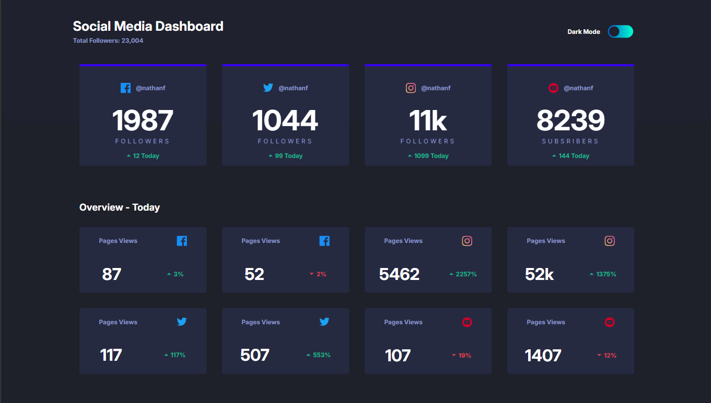
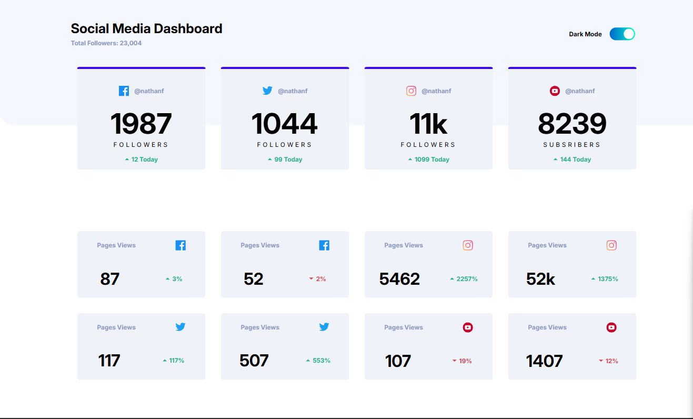

# Frontend Mentor - Social media dashboard with theme switcher solution

This is a solution to the [Social media dashboard with theme switcher challenge on Frontend Mentor](https://www.frontendmentor.io/challenges/social-media-dashboard-with-theme-switcher-6oY8ozp_H). Frontend Mentor challenges help you improve your coding skills by building realistic projects. 

### The challenge

Users should be able to:

- View the optimal layout for the site depending on their device's screen size
- See hover states for all interactive elements on the page
- Toggle color theme to their preference

### Screenshot

### Links

- Solution URL: https://github.com/kaustubha-saxena/Social-media-dashboard
- Live Site URL: https://social-media-dashboard-app.netlify.app/
## My process

### Built with

- Semantic HTML5 markup
- CSS custom properties
- Flexbox
- CSS Grid

## Author

- Website - [Kaustubha Saxena](https://github.com/kaustubha-saxena)
- Frontend Mentor - [@kaustubha-saxena](https://www.frontendmentor.io/profile/kaustubha-saxena)
- X - @KaustubhaSaxena (https://x.com/KaustubhaSaxena)

